# Quarto Projeto - Burger Queen (API Client)

## Índice

- [1. Introdução](#1-Introdução)
- [2. Resumo do Projeto](#2-Resumo-do-projeto)
- [3. Futuro do Projeto](#3-Futuro-do-Projeto)
- [4. Proto Personas](#4-PROTO-PERSONAS)
- [5. Pesquisa de usuários](#5-Pesquisa-de-usuários)
- [6. Histórias de usuário](#6-histórias-de-usuário)
- [7. Fluxogramas](#7-Fluxogramas)
- [8. Design](#8-Design)
- [9. Demonstrações da Aplicação Web](#9-Demonstrações-da-Aplicação-Web)
- [10. Tecnologias e Ferramentas Utilizadas ](#10-Tecnologias-e-Ferramentas-Utilizadas)
- [11. Desenvolvedoras](#11-desenvolvedoras)

## 1. Introdução

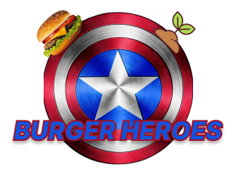

<h2>Burger Heroes</h2>

A hamburgueria Burger Heroes foi o quarto projeto desenvolvido no Bootcamp da Laboratória. Neste projeto desenvolvemos uma aplicação web na modalidade _mobile first_ (_tablet_) para aprimorar e agilizar o atendimento de uma hamburgueria. Através desta aplicação é possível que os funcionários do setor de atendimento e cozinha gerenciem os pedidos de seus clientes.

---
## 2. Resumo do projeto

A Burger Heroes busca oferecer aos seus clientes um atendimento ágil e com qualidade, com essa intenção, nada melhor do que facilitar a comunicação entre clientes, garcons e cozinha. 
Buscamos com essa aplicação fornecer aos clientes uma experiência única, adotamos uma referência aos heróis da Marvel e DC, mas na realidade acreditamos que qualquer pessoa que opte por utilizar produtos _eco-friendly_ são os verdadeiros heróis do planeta, por esse motivo a Burger Heroes utiliza produtos e utensílios que não agridem o meio ambiente, porque acreditamos que os verdadeiros heróis são os nossos próprios clientes.  
Por meio desta aplicação web é possível que o atendimento adicione pedidos a mesa do cliente, inserindo o numero e o nome da pessoa que está atendendo e assim, envia-los para a cozinha. 
A cozinha recebe o pedido enviado pelo atendimento para inciar seu preparo e, logo que o pedido estiver pronto, envia-lo de volta ao atendimento para que seja realizada a entrega. 
Na aplicação haverá uma aba de histórico de pedidos onde os mesmos permanecerão sendo exibidos, mesmo que finalizados, ainda portando o ID, duração do preparo e entrega.

Para ingressar nesse mundo dos heróis, há a possibilidade de efetuar seu próprio cadastro com seu _e-mail_ e _senha_ ou se preferir, pode usar os acessos abaixo:

| # | Login ATENDIMENTO | 
|:-----------------------:|:----------------------------: |
| &#128233; | atendimento@burgerheroes.com| 
| &#128272; | 123456 | 

---

| # | Login COZINHA | 
|:-----------------------:|:----------------------------: |
| &#128233; | cozinha@burgerheroes.com| 
| &#128272; | 123456 | 

---
## 3. Futuro do Projeto

Futuramente iremos melhorar a segurança de nossos usuários acrescentando uma Política de Privacidade e Cookies bem como um termo de usuário para melhor atender ao disposto na Lei Geral de Proteção de Dados Pessoais (LGPD). 
Pensando em um modelo futurista será criado um ambiente exclusivo para cadastro, _login_ e senha do próprio cliente. Desta forma, será possível que o cliente escolha se quer realizar o seu proprio atendimento.
Esta projeto também será refatorado. Será aprimorada a responsividade para os tablets e iremos acrescenta-la para celulares. Serão implementadas melhorias na estilização através do CSS.
Também serão implementados novos testes assíncronos e unitários.
Acrescentaremos também novos recursos para melhorar a acessibilidade na aplicação.

---

## 4. PROTO PERSONAS

Criamos as proto personas da nossa aplicação:

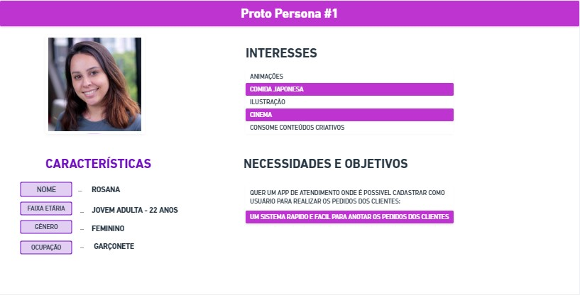

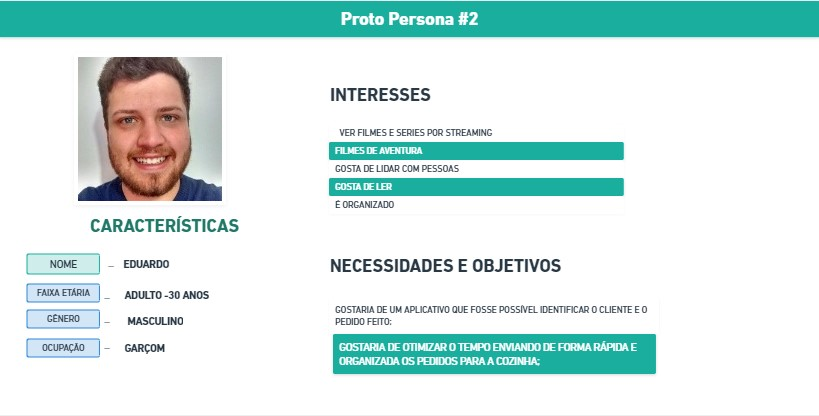

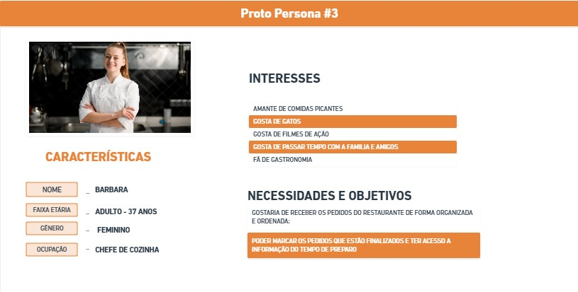

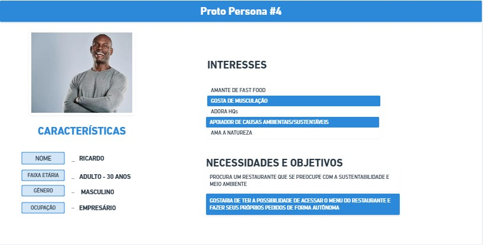

---

## 5. PESQUISA DE USUÁRIOS

Realizamos uma [pesquisa](https://forms.gle/S95Z9Ug8s7HbAwJGA) para validarmos as proto personas. A pesquisa obteve a participação de 8 pessoas que nos forneceram os seguintes resultados:

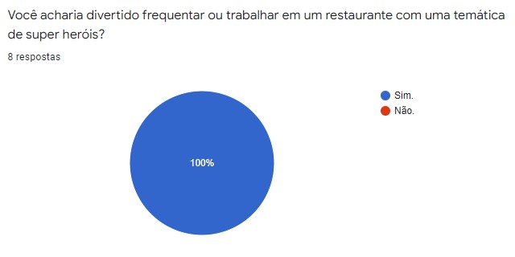

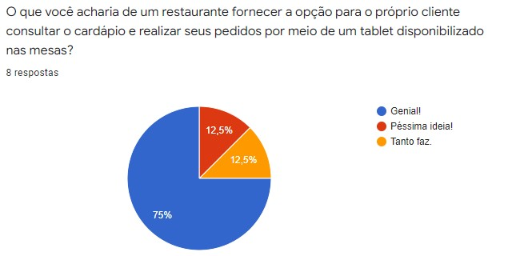

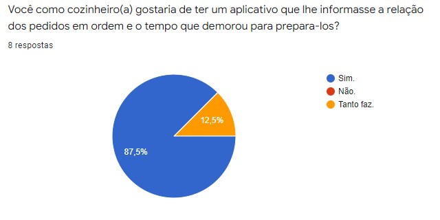

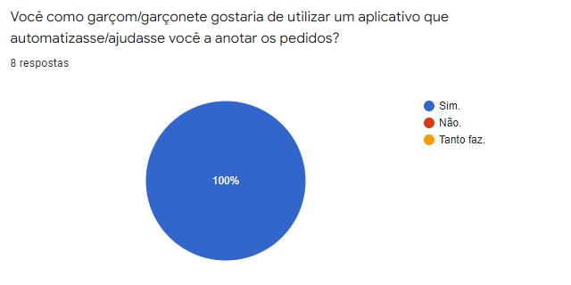

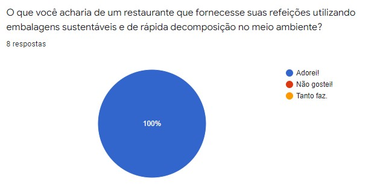

---

## 6. HISTORIAS DE USUÁRIO

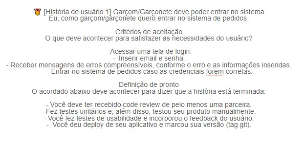

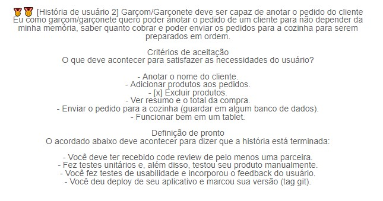

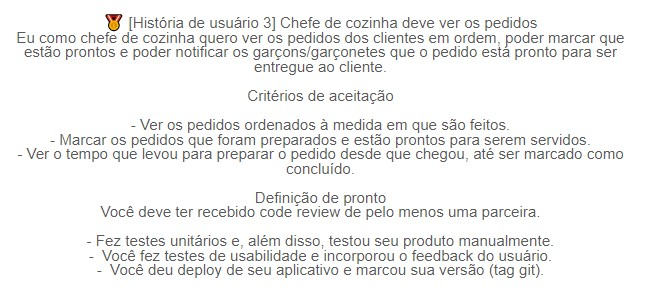

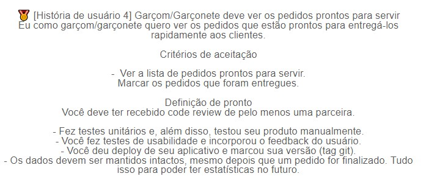

---

## 7. FLUXOGRAMAS

Com base nas historias de usuário nós criamos os fluxogramas para cada uma delas.

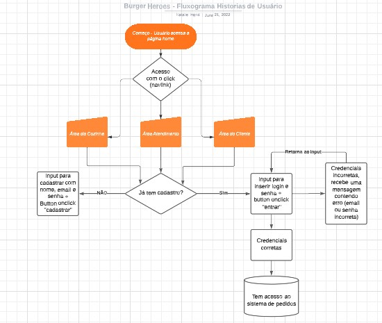

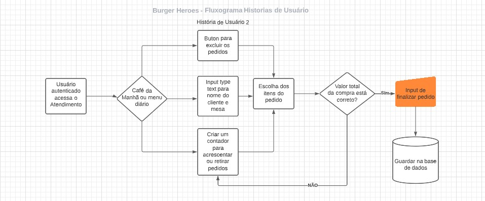

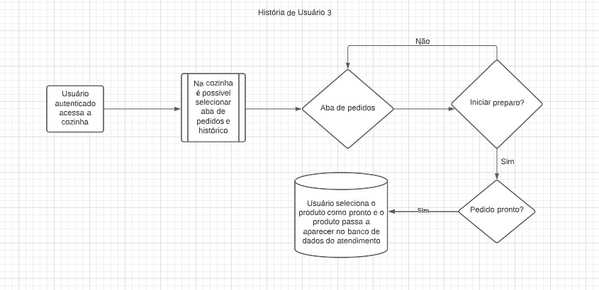

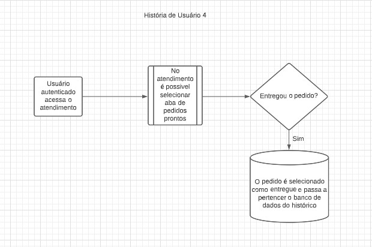

---
## 8. PROTÓTIPO E TESTES DE USABILIDADE

Visamos uma aplicação que refletisse as cores marcantes dos super heróis dos quadrinhos e escolhemos a fonte que remetesse as utilizadas nos HQ's para tornar a experiência mais divertida.

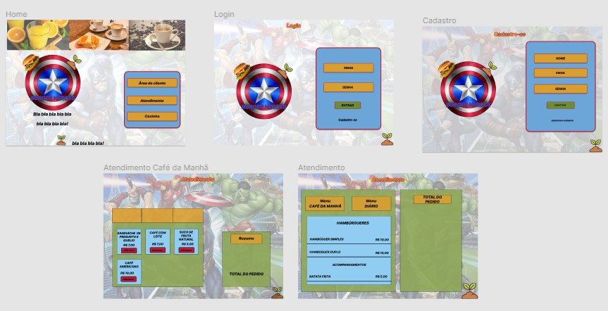
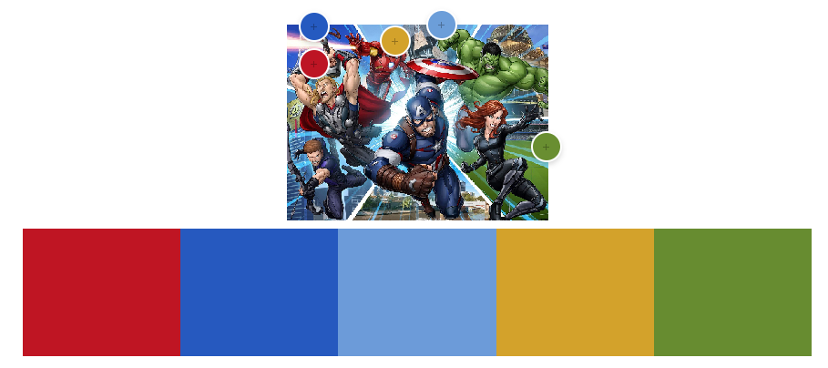

Com o auxílio do figma também criamos um protótipo interativo para ser utilizado nos testes iniciais de usabilidade.

  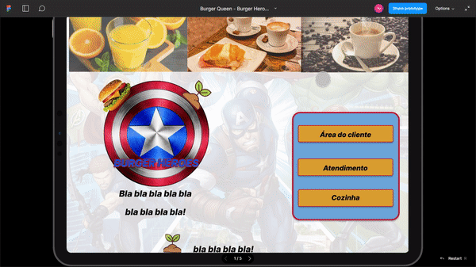

---
## 9. DEMONSTRAÇÕES DA APLICAÇÃO WEB

Versão Web

  
  
  

Versão Tablet

  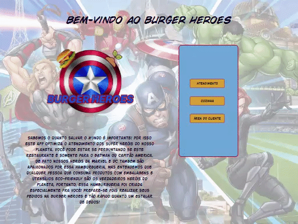
  

---
## 10. TECNOLOGIAS E FERRAMENTAS UTILIZADAS

- Planejamento: [Trello](https://trello.com/b/teBSp1E8/burger-queen-burger-heroes)
- Protótipos: [Figma](https://www.figma.com/file/6xnHbLDVtOnINJdLrRTRpE/Burger-Queen---Burger-Heroes?node-id=0%3A1)
- HTML 5
- CSS3
- JavaScript Vanilla
- Node.js
- React
- API
- Git
- GitHub
- GitHub Project
- Jest
- JSX
- Visual Studio Code
- Firebase
- Figma
- Heroku
- Slack
- Trello

---
## 11. Considerações.

Burger Heroes foi desenvolvido por [_Fernanda Monteiro_](https://github.com/Fe-Monteiro) e [_Natalie Silva_](https://github.com/natalieiss) e formamos uma incrível dupla, sendo nosso quarto projeto a ser realizado no Bootcamp da <Laboratória> &#128155; na turma SAP007 e nos ensinou sobre:
- Manipulação do DOM, Objetos e Array;
- Funções;
- Consumo de banco de dados externo;
- React;
- Desenvolvimento de testes unitários;
- Responsividade;
- UX Design;
- GitHub;
- Eslint;
- Aprender a aprender;

<table align="center">
 <td align="center">
      <a href="https://github.com/Fe-Monteiro">
   
             
          <b>Fernanda Monteiro</b>
        
      </a>
    </td>
    <td align="center">
      <a href="https://github.com/natalieiss">
           
  
          <b>Natalie Silva</b>
        
      </a>
    </td>
</table>

Agradecemos por esse grande desafio, pela dupla fantástica e pelo apoio das mentoras, psicólogas e colegas de squad.